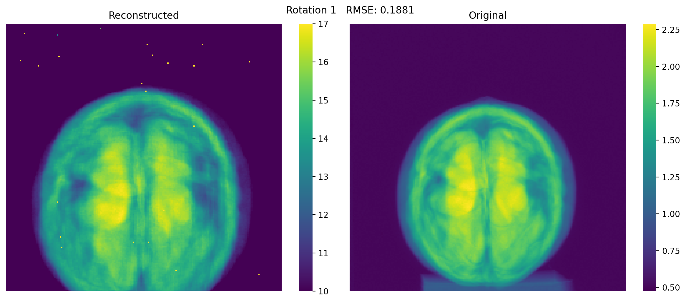

# 3D Cone Beam Computed Tomography (CBCT) Reconstruction

Reconstruct object's attenuation constant data from projections captured by the detector.

This code has been written for cone beam based geometry.
Cone beam CT is a more recent development which emits a "cone type" X-ray and is detected by a flat panel sensor.

## Mathematical statement

The problem is expressed mathematically as: A λ = d

A is the intercept matrix containing lengths of X-ray intercepts on each voxel within the object.
λ is the attenuation coefficient data for each voxel, which is the desired output.
d is the sinogram, calculated as -

$$d=\ln(\frac{I_o}{I})$$

where,

- $I_o$ is the intensity of the X-ray source.
- $I$ is the intensity observed by the detectors.

## Methodology

Usually, the FDK algorithm is used to reconstruct the volume directly without calculating the intercept matrix A. 

However, this project aims to calculate and study the intercept matrix specifically. A 3 dimension version of Siddon's method is used to calculate it. The volume can be reconstructed by computing $A^{-1} d$.

As the matrix is large and sparse, it is impossible to find its inverse simply. Therefore, we study ways to create a more dense matrix and to efficiently approximate $A^{-1} d$. One nice method is to use pseudoinverse.

## Fan Beam CT Reconstruction (2D)

The top is fan beam configuration for 2D image. The figure shows how it differs from the cone beam geometry (bottom) used in this repo. The code for 2D reconstruction is [here](https://github.com/aakashks/CT-Reconstruction-2D/blob/main/).

## Results

Generated projection (forward problem) for 1 rotation. [results for more rotations](results/generated_vs_projections/)

These results assure the correctness of the generated intercept matrix (A).

The current code can generate the 50 rows of the whole matrix, ie. for 50 rotations of the object in less than 7 hours on a single NVIDIA P100 GPU with 16 GB RAM for 200x200 resolution.

## References

1. The data has been collected from experiments conducted at DDIL, IIT Roorkee
2. G. Aldica, Ion Tiseanu, Petre Badica, & Rindfleisch, M. (2010, August 18). X-ray Micro-Tomography as a New and Powerful Tool for Characterization of MgB2 Superconductor. ResearchGate
3. Cone beam vs. fan beam CT. (2023). [Aofoundation.org](https://surgeryreference.aofoundation.org/cmf/further-reading/cas-cone-beam-vs-fan-beam-ct#introduction)
4. [Siddon's Algorithm](https://stackoverflow.com/questions/3609382/calculating-the-length-of-intersections-through-a-2d-grid)
